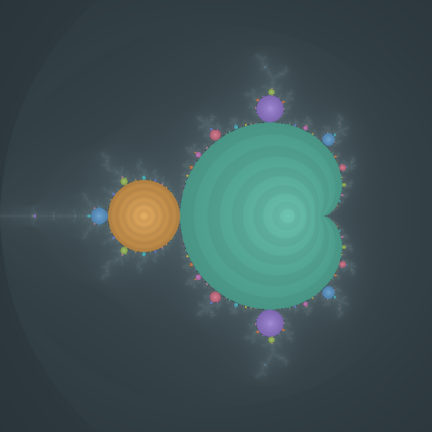
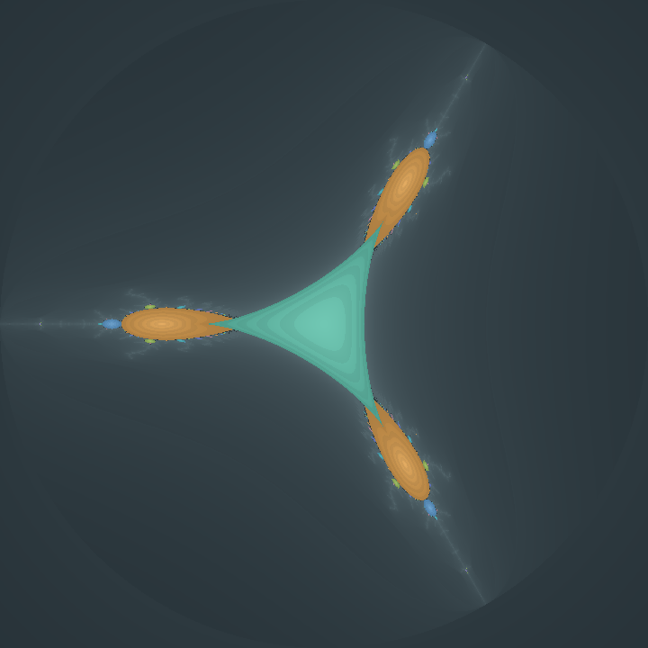
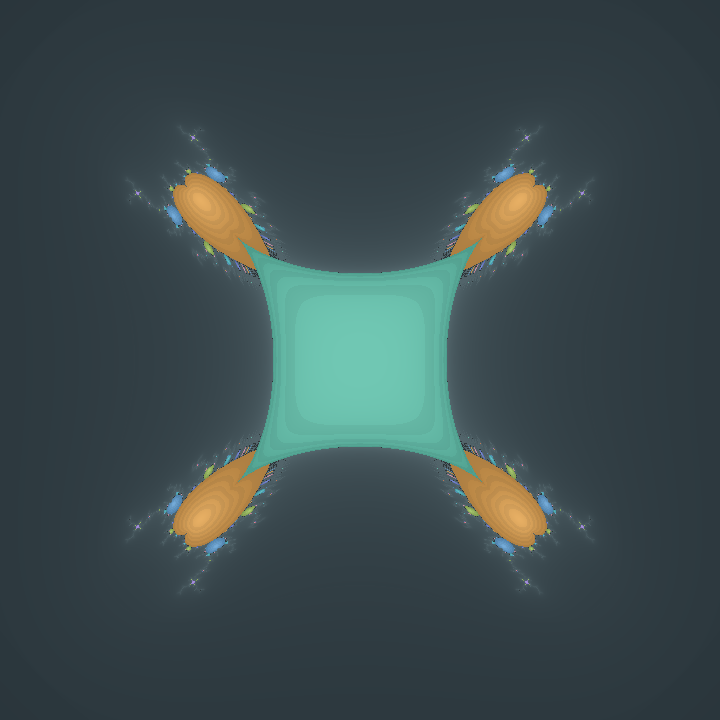
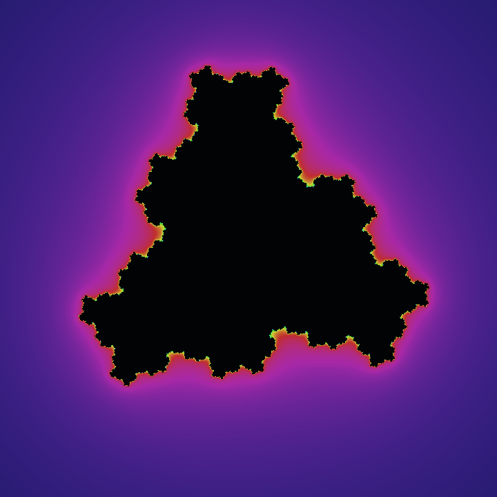
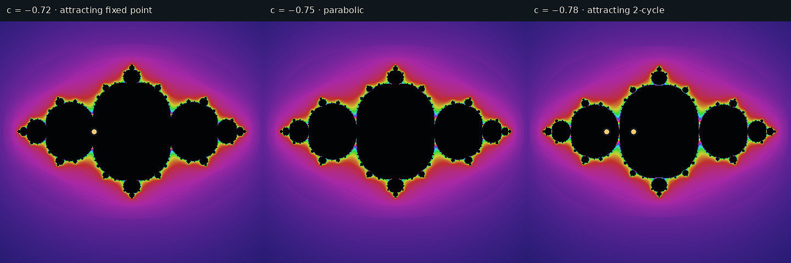

# Draw Tricorn

Interactive explorer for the unicritical families

\[
f_c(z)=z^d+c
\qquad\text{and}\qquad
f_c(z)=\overline{z}^{\,d}+c,
\quad d\geq2.
\]

It places the parameter and dynamical planes side by side. Python/Tk owns the
GUI, image presentation, and interaction; a shared C library owns the normal
float/double calculations, including pixel rendering, orbit iteration, rays,
parameter-ray Newton continuation, and internal-coordinate contours. Python is
kept as the numerical backend only for arbitrary-precision work. The map type
and degree can be changed from the top bar; the parameter plane then shows the
corresponding multibrot or multicorn.



## Highlights

- Holomorphic and antiholomorphic dynamics in degrees 2 through 12 in the GUI
  (the command-line renderer accepts degrees through 32).
- Muted parameter-plane escape colors, a bright period palette for attracting
  components, multiplier and Lyapunov views, and a dark-interior rainbow Julia
  palette.
- Component-period certification through a user-selected maximum period.
  Newton iteration is applied to a holomorphic return map; odd-period
  antiholomorphic cycles use \(f_c^{2p}\), followed by an exact-period check
  under \(f_c\).
- Dynamical rays at rational angles, their forward angle orbits, landing
  estimates, orbit portraits, sectors, and separately controlled
  equipotentials.
- Parameter-ray continuation for both families in C. The antiholomorphic
  solver propagates Wirtinger derivatives and solves a real two-dimensional
  Newton problem.
- C-backed attracting critical cycles, a selectable dynamical point that can
  be iterated with Space, and native internal Koenigs/Böttcher grand-orbit
  contours.
- Linear parameter paths \(c(t)=(1-t)A+tB\) with on-demand Julia rendering,
  play/pause, scrubbing, and single-frame stepping. This is useful for watching
  an attracting cycle cross a parabolic bifurcation.
- Square zoom rectangles by default, 1×/2×/3× rendering, PNG export, and
  automatic float/double/arbitrary-precision selection. The app asks before
  switching a deep zoom to the slower arbitrary-precision renderer.

## Gallery

| Antiholomorphic degree 2 | Antiholomorphic degree 3 |
|---|---|
|  |  |

| Holomorphic degree-three Julia set | Crossing a parabolic parameter |
|---|---|
|  |  |

The last image samples \(z^2+c\) at \(c=-0.72\), \(-0.75\), and \(-0.78\).
The middle value is the period-one/period-two parabolic bifurcation. The path
player can sample the entire interval with any frame count from 2 to 2000.

## Quick start

The application needs a C17 compiler, GNU Make, Python 3.10 or newer, Tk, and
the Python packages in `requirements.txt`.

```bash
python3 -m venv .venv
source .venv/bin/activate
python -m pip install --upgrade pip
python -m pip install -r requirements.txt
make
python app.py
```

### Display sizing

The GUI now adapts its two drawing canvases to the available screen size. On
common 1366×768 and other short 16:9 displays it uses a compact 440-pixel
canvas, on medium-height displays it uses 520 pixels, and on larger displays it
keeps the original 620-pixel canvas. Render-quality choices are recalculated
from the selected display size, so 1×, 2×, and 3× rendering continue to behave
consistently while the parameter-plane controls remain visible.

The Makefile builds both `build/fractal-renderer` and
`build/libbifurcation.so` (`.dylib` on macOS). It enables OpenMP when the selected compiler supports
it and builds serial versions otherwise. The GUI loads the shared library with
`ctypes`; it does not start a renderer subprocess for ordinary float/double
renders.

### Ubuntu and Debian

```bash
sudo apt update
sudo apt install build-essential python3 python3-venv python3-tk
python3 -m venv .venv
source .venv/bin/activate
python -m pip install -r requirements.txt
make
python app.py
```

`python3-tk` is the distribution package that supplies Tkinter
([Ubuntu package search](https://packages.ubuntu.com/search?keywords=python3-tk)).

### Arch Linux

```bash
sudo pacman -S --needed base-devel python tk
python -m venv .venv
source .venv/bin/activate
python -m pip install -r requirements.txt
make
python app.py
```

Tk is available as Arch's official
[`tk`](https://archlinux.org/packages/extra/x86_64/tk/) package.

### Nix / NixOS

Open a temporary development shell:

```bash
nix-shell -p gcc gnumake \
  'python3.withPackages (ps: [ ps.tkinter ps.pillow ps.mpmath ps.numpy ])'
make
python3 app.py
```

This keeps the dependencies outside the project and is suitable for trying the
app without adding a permanent system configuration.

### macOS

Install Apple's command-line tools and a Tk-enabled Homebrew Python:

```bash
xcode-select --install
brew install python-tk@3.13
python3.13 -m venv .venv
source .venv/bin/activate
python -m pip install -r requirements.txt
make
python app.py
```

Homebrew publishes the versioned
[`python-tk@3.13`](https://formulae.brew.sh/formula/python-tk%403.13)
formula. Apple Clang normally builds the serial C renderer; this is supported.

### Windows

The supported route is Ubuntu under WSL:

```powershell
wsl --install
```

Restart if Windows asks, open Ubuntu, and follow the Ubuntu instructions above.
Microsoft documents the installation and supported Windows versions in
[Install WSL](https://learn.microsoft.com/en-us/windows/wsl/install).
Native MSYS2 builds may work, but are not part of the tested configuration.

## First explorations

### Compare a tricorn and a Mandelbrot set

1. Start with **Antiholomorphic**, degree **2**, and **Component periods**.
2. Set the component search limit to 12 or 20 and click **Render**.
3. Change **Map** to **Holomorphic**. The same renderer now displays the
   Mandelbrot family, while the palette keeps equal periods visually distinct.

### Animate a parabolic bifurcation

1. Choose **Holomorphic**, degree **2**.
2. Click **Animate path…**, set \(A=-0.72+0i\) and \(B=-0.78+0i\), and use
   81 frames.
3. Leave **Attracting critical orbit** enabled.
4. Press **Play** or F5. Use Left/Right to inspect individual frames.

Frames are rendered one at a time and never overlap. The Julia viewport remains
fixed during playback, and the attracting orbit is recomputed for every
parameter. Requested FPS is therefore an upper bound: high-quality or
arbitrary-precision frames can render more slowly.

### Explore a higher-degree multicorn

Choose **Antiholomorphic**, degree **3**, use **Component periods**, and raise
the period-search limit gradually. In the dynamical plane, draw a ray at
\(1/13\); its image angle is \(-3/13\pmod 1\). For the holomorphic family the
angle map is \(t\mapsto dt\), while for the antiholomorphic family it is
\(t\mapsto-dt\).

### Follow a point in the dynamical plane

Click the Julia image, or use **Set z…** for exact coordinates. Press Space to
apply \(f_c\) once. The green marker moves without an animation, so a finite or
attracting orbit can be inspected step by step.

## Controls

| Action | Parameter plane | Dynamical plane |
|---|---|---|
| Grayscale mode | Ctrl+B | Alt+B |
| Main color mode | Ctrl+C | Alt+C |
| Component periods | Ctrl+P | — |
| Newton multiplier | Ctrl+N | — |
| Lyapunov multiplier | Ctrl+L | — |
| Iteration preset 1–5 | Ctrl+1…5 | Alt+1…5 |
| Reset zoom | Ctrl+R | Alt+R |
| Apply map to selected point | — | Space |
| Replace rays by their images | — | Alt+Right |
| Add ray images to existing rays | — | Alt+Shift+Right |
| Play or pause parameter path | F5 | F5 |
| Previous/next path frame | Left/Right | Left/Right |

Buttons expose the same operations, so memorizing shortcuts is optional. Text
inputs retain normal Space and arrow-key behavior.

## Architecture

The GUI-facing Python modules are thin wrappers around coarse-grained C calls:

```text
app.py / Tk / Pillow
        |
        | ctypes
        v
build/libbifurcation.so or .dylib
        |-- float/double image rendering
        |-- unicritical maps and attracting cycles
        |-- dynamical rays and equipotentials
        |-- parameter-ray derivatives and Newton continuation
        `-- internal Koenigs/Böttcher contours

math_backend/arbitrary_renderer.py + high_precision.py
        `-- mpmath/NumPy arbitrary-precision fallback
```

A complete render, ray, parameter ray, or contour set is calculated in one C
call. This avoids per-iteration Python/C crossings and lets OpenMP operate on
large native workloads. Exact rational-angle bookkeeping remains in Python as
`Fraction` arithmetic because it is symbolic, small, and not a performance
bottleneck.

The command-line renderer remains available for scripts and regression tests;
it and the shared library use the same rendering core.

## Command-line renderer

The C binary writes a binary PPM file. For example:

```bash
build/fractal-renderer \
  --kind parameter \
  --dynamics holomorphic \
  --degree 3 \
  --mode period \
  --max-period 16 \
  --iterations 512 \
  --width 1200 --height 1200 \
  --xmin -2 --xmax 2 --ymin -2 --ymax 2 \
  --output multibrot-d3.ppm
```

```bash
build/fractal-renderer \
  --kind julia \
  --dynamics antiholomorphic \
  --degree 4 \
  --mode escape \
  --cx -0.2 --cy 0.55 \
  --iterations 800 \
  --width 1200 --height 1200 \
  --xmin -2 --xmax 2 --ymin -2 --ymax 2 \
  --output anti-julia-d4.ppm
```

Run `build/fractal-renderer --help` for every option. The old
`--kind tricorn` spelling remains as a compatibility alias for
`--kind parameter`.

## Numerical notes and limitations

- Escape membership is numerical: a point that has not escaped after the
  selected iteration limit is treated as inside.
- A component color is assigned only when an attracting cycle of exact period
  at most the chosen limit is certified. Other bounded pixels use a neutral
  color. The explicit deltoid test is used only for the period-one
  antiholomorphic quadratic component.
- The second iterate of an antiholomorphic map is holomorphic in \(z\). This
  makes ordinary complex Newton iteration available for periodic-point and
  multiplier calculations. It does **not** make the family holomorphic in the
  parameter \(c\); antiholomorphic parameter-ray continuation therefore solves
  for \(c\) and \(\bar c\) as a real two-variable problem.
- Dynamical rays are inverse-Böttcher approximations. Their endpoint potential
  adapts to the current viewport and render size, so retracing after a zoom
  places them closer to the Julia set. Near a non-locally-connected boundary,
  an endpoint sample is not a proof of landing.
- Multicorn parameter rays can accumulate on positive-length parabolic arcs
  rather than land at a single point. The UI deliberately reports a final
  numerical sample instead of promising a landing point.
- Internal Koenigs/Böttcher contours are numerical basin coordinates, clipped
  to the visible viewport and generated by the C backend.
- Coordinates needing more than binary64 precision stay on the Python/mpmath
  path. This includes deep-zoom rendering and arbitrary-precision ray or
  parameter-ray pullbacks; normal float/double work does not use Python loops.

More implementation detail is in
[`docs/NUMERICAL_ROADMAP.md`](docs/NUMERICAL_ROADMAP.md).

## Project layout

- `src/fractal.c` and `src/palette.c` — shared float/double pixel-rendering
  core used by both front ends.
- `src/numeric.c` — native maps, attracting cycles, dynamical rays,
  equipotentials, derivatives, and parameter-ray Newton continuation.
- `src/internal_curves.c` — native internal-coordinate fields, marching
  squares, and polyline stitching.
- `src/main.c` — command-line PPM front end.
- `math_backend/` — Python bindings and dataclasses. `c_api.py` loads the shared
  library; `arbitrary_renderer.py` and `high_precision.py` contain the retained
  mpmath/NumPy fallback.
- `app.py` — Tk application, pane state, vector-overlay drawing, and animation
  controller. `draw.py` is the compatibility launcher.
- `tests/` — renderer, native-library, precision, ray, overlay, and path
  regression tests.

Only GUI launchers remain as Python files in the project root; numerical Python
code is contained in `math_backend/`.

Run the suite with:

```bash
make test
```

## Sources and attribution

The first version of this project was adapted from the code/algorithm presented
on Adam Majewski's Wikimedia Commons page
[*Mandelbrot set – multiplier map*](https://commons.wikimedia.org/wiki/File:Mandelbrot_set_-_multiplier_map.png).
That page credits code/algorithm by Claude Heiland-Allen and algorithms and
descriptions by Robert P. Munafo, and publishes the file under
[CC BY-SA 4.0](https://creativecommons.org/licenses/by-sa/4.0/). The program substantially reorganizes and generalizes that starting point, but this
lineage is intentionally retained.

Mathematical and numerical references:

- W. D. Crowe, R. Hasson, P. J. Rippon, and P. E. D. Strain-Clark,
  “On the structure of the Mandelbar set,” *Nonlinearity* **2** (1989),
  541–553. [DOI: 10.1088/0951-7715/2/4/003](https://doi.org/10.1088/0951-7715/2/4/003).
- Sabyasachi Mukherjee, “Orbit portraits of unicritical antiholomorphic
  polynomials,” *Conformal Geometry and Dynamics* **19** (2015), 35–50.
  [DOI: 10.1090/S1088-4173-2015-00276-3](https://doi.org/10.1090/S1088-4173-2015-00276-3).
- Tomoki Kawahira, “An algorithm to draw external rays of the Mandelbrot set”
  (2009). [Author's PDF](https://www1.econ.hit-u.ac.jp/kawahira/programs/mandel-exray.pdf).
- Hiroyuki Inou and Sabyasachi Mukherjee, “Non-landing parameter rays of the
  multicorns.” [arXiv:1406.3428](https://arxiv.org/abs/1406.3428).
- Sabyasachi Mukherjee, Shizuo Nakane, and Dierk Schleicher, “On multicorns
  and unicorns II: bifurcations in spaces of antiholomorphic polynomials.”
  [arXiv:1404.5031](https://arxiv.org/abs/1404.5031).
- John Milnor, *Dynamics in One Complex Variable*, third edition, Princeton
  University Press, 2006, especially the sections on Böttcher and Koenigs
  coordinates.
